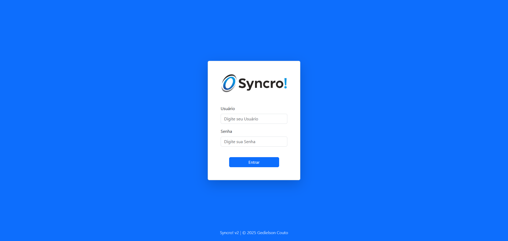
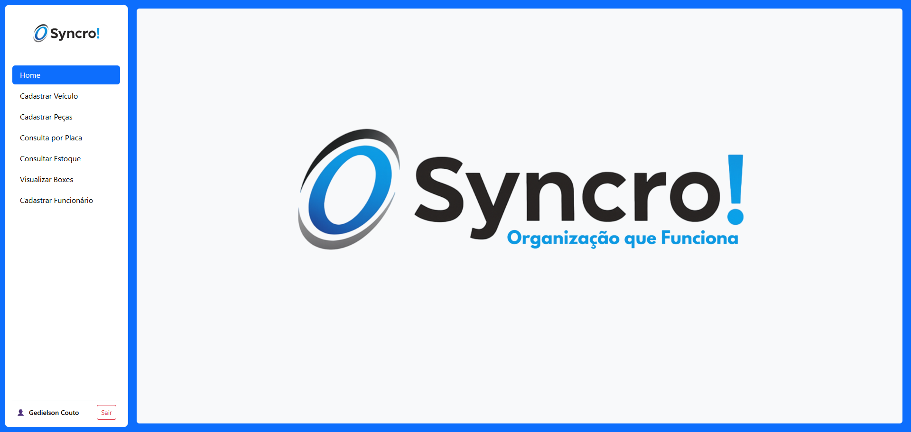
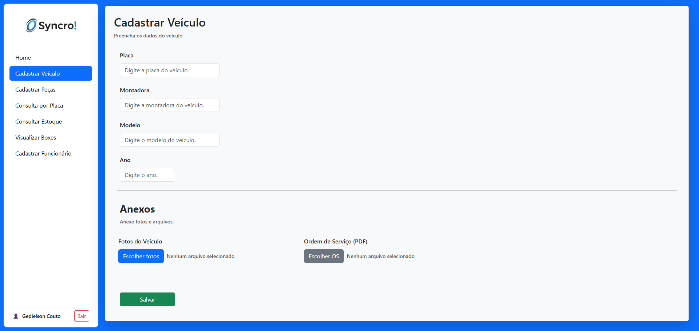
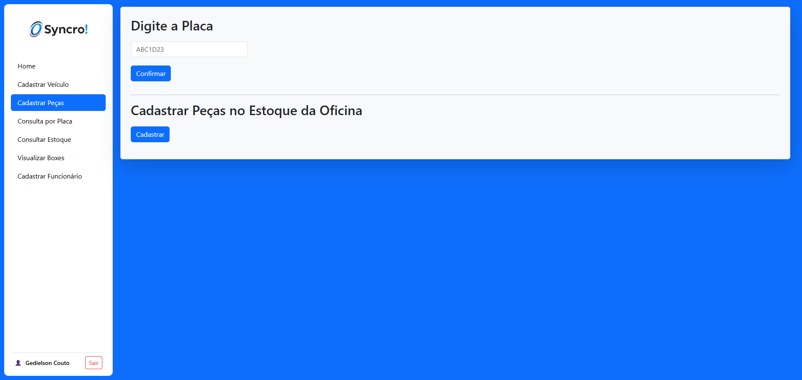
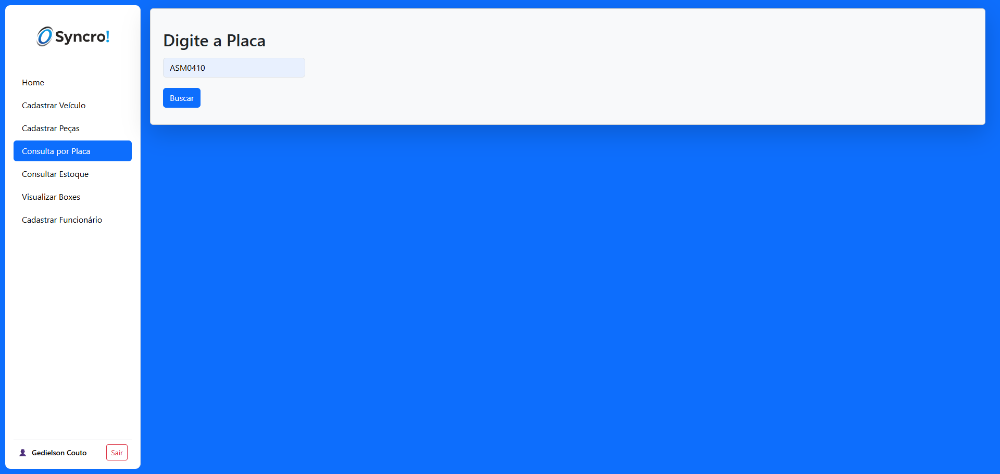
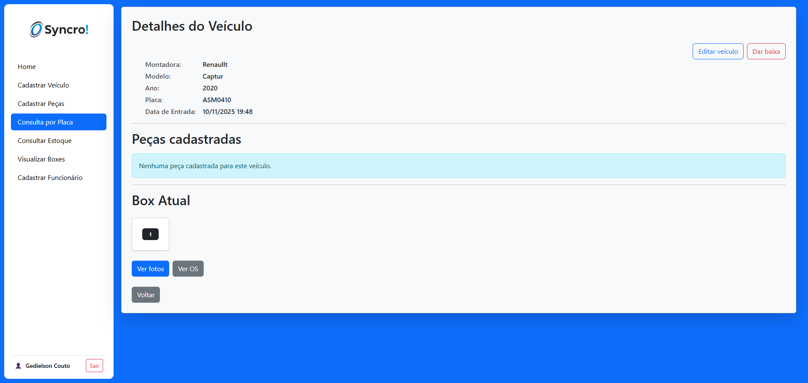
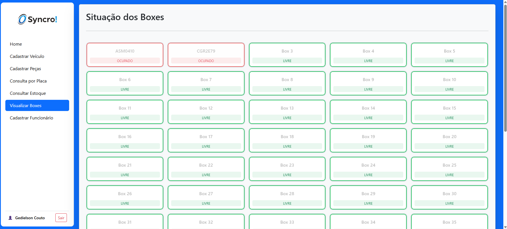
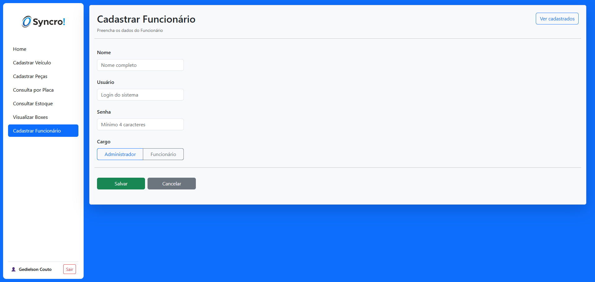

# Syncro!

O Syncro! é um sistema web desenvolvido em Java com Spring Boot, criado para auxiliar na gestão de veículos, peças e estoque em oficinas de chapeação e pintura.

O projeto foi desenvolvido como Trabalho de Conclusão de Curso (TCC) no curso Técnico em Informática, aplicando conceitos de engenharia de software, levantamento de requisitos, modelagem de dados e desenvolvimento web.

---

## 🚀 Tecnologias utilizadas
- Java
- Spring Boot
- Spring MVC
- Spring Data JPA
- Thymeleaf
- MySQL
- Bootstrap
- Maven

---

## ⚙️ Funcionalidades
- Autenticação de usuários com níveis de acesso
- Cadastro, edição e baixa de veículos
- Consulta por placa
- Associação de peças aos veículos
- Controle de boxes de estoque
- Upload de fotos e arquivos (ordens de serviço)
- Interface web responsiva para desktop e mobile

---

## 📌 Status do projeto
Projeto concluído como TCC.  
Possíveis evoluções podem ser realizadas conforme a necessidade futura.

---

## 📷 Telas do sistema
### Login

### Home

### Cadastro de veículo

### Cadastro de peça

### Consulta por placa

### Informação do veículo

### Estoque de peças

### Controle de boxes

### Cadastro de funcionário

